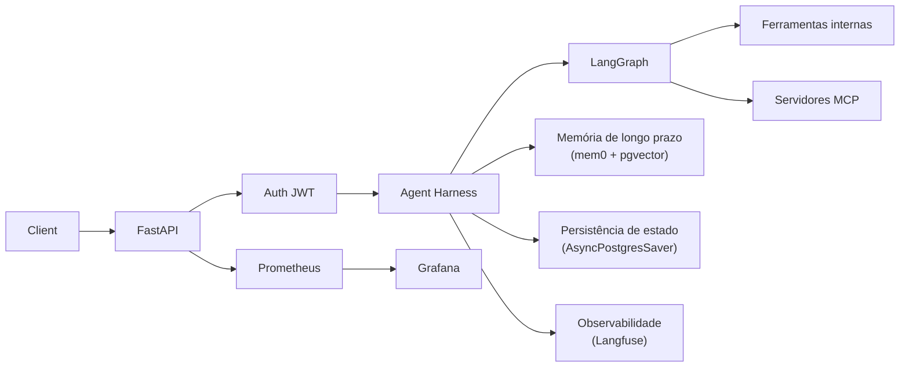

# Template Agent Harness: Infraestrutura de Agentes de IA Pronta para Produção

Um harness para criar e executar agentes de IA em produção.
Você define a lógica do agente; o harness fornece autenticação, memória, observabilidade, persistência de estado, rate limiting, guardrails e monitoramento.

Construído com **LangGraph**, **FastAPI**, **Langfuse**, **PostgreSQL + pgvector** e **MCP**.

## Arquitetura



Seu agente é um diretório autocontido em `src/app/agents/`. O harness cuida de todo o resto.

## O Que Você Recebe

**Camada de API**

- FastAPI com endpoints assíncronos e otimização com uvloop.
- Autenticação baseada em JWT com gerenciamento de sessões (register, login, múltiplas sessões).
- Rate limiting por endpoint via slowapi.
- Respostas em streaming (SSE) para chat em tempo real.

**Memória e Estado**

- Memória semântica de longo prazo via mem0ai + pgvector (por usuário, com extração e recuperação automáticas).
- Persistência de estado da conversa via checkpointing `AsyncPostgresSaver` do LangGraph.
- Atualizações de memória em background, sem bloquear respostas.

**Observabilidade**

- Tracing Langfuse em todas as chamadas de LLM, com metadados de ambiente e sessão.
- Métricas Prometheus para performance da API, rate limits e duração de inferência da LLM.
- Dashboards Grafana pré-configurados.
- Logging estruturado com structlog: JSON em produção, console colorido em desenvolvimento.
- Binding automático de contexto de request (`request_id`, `session_id`, `user_id`).

**Gerenciamento de LLM**

- Retries automáticos com exponential backoff.

**Framework de Avaliação**

- Avaliação de saídas do modelo baseada em métricas usando traces do Langfuse.
- Métricas internas: relevancy, helpfulness, conciseness, hallucination, toxicity.
- Relatórios JSON com detalhamento por métrica e por trace.
- CLI interativa com saída colorida.

**DevOps**

- Stack Docker Compose: PostgreSQL (pgvector), Prometheus, Grafana, cAdvisor.
- Configurações por ambiente (`.env.development`, `.env.staging`, `.env.production`).
- Makefile para operações comuns.
- Workflow CI/CD com GitHub Actions.

## Crie Seu Próprio Agente

Cada agente vive em seu próprio diretório em `src/app/agents/`.
Os agentes incluídos `chatbot`, `text_to_sql` e `open_deep_research` são referências funcionais.

### 1. Crie o diretório do agente

```text
src/app/agents/my_agent/
  __init__.py          # helper load_system_prompt()
  agent.py             # sua classe de agente
  system.md            # template de system prompt
  tools/
    __init__.py        # exporta sua lista de ferramentas
    my_tool.py         # implementações de ferramentas customizadas
```

### 2. Defina o system prompt

`system.md` suporta os placeholders `{long_term_memory}` e `{current_date_and_time}`, além de kwargs customizados que você passar.

```markdown
# Name: {agent_name}
# Role: Descrição do papel do seu agente

Instruções para o agente.

# O que você sabe sobre o usuário
{long_term_memory}

# Data e hora atuais
{current_date_and_time}
```

### 3. Conecte a um endpoint de API

```python
from src.app.agents.my_agent.agent import MyAgent
from src.app.agents.my_agent.tools import tools

async def get_my_agent() -> MyAgent:
    agent = MyAgent("My Agent", llm_service, tools, await get_checkpointer())
    await agent.compile()
    return agent
```

Depois use `agent.agent_invoke()` ou `agent.agent_invoke_stream()` no handler da rota, exatamente como `src/app/api/v1/chatbot.py` faz com `AgentExample1`.

## Início Rápido

### Pré-requisitos

- Python 3.13+
- PostgreSQL com extensão pgvector
- Docker e Docker Compose (opcional)

### Setup

```bash
# Clone e instale
git clone <repository-url>
cd <project-directory>
uv sync

# Configure o ambiente
cp .env.example .env.development
# Edite .env.development com suas chaves (OPENAI_API_KEY, POSTGRES_*, LANGFUSE_*, JWT_SECRET_KEY)

# Rode
make dev
```

Swagger UI: `http://localhost:8000/docs`

### Testes

```bash
uv run pytest tests/
```

### Banco de Dados

O ORM cria as tabelas automaticamente. Se necessário, rode `schema.sql` manualmente. Configure no seu arquivo `.env`:

```bash
POSTGRES_HOST=localhost
POSTGRES_PORT=5432
POSTGRES_DB=cool_db
POSTGRES_USER=postgres
POSTGRES_PASSWORD=postgres
```

### Docker

```bash
# Build e execução para um ambiente específico
make docker-build-env ENV=development
make docker-run-env ENV=development

# Stack completa (API + PostgreSQL + Prometheus + Grafana + cAdvisor)
make docker-compose-up ENV=development
```

Endpoints de monitoramento:

- Prometheus: `http://localhost:9090`
- Grafana: `http://localhost:3000/d/llm-latency/llm-observability` (admin/admin)

## Configuração

Arquivos por ambiente: `.env.development`, `.env.staging`, `.env.production`

Variáveis principais:

| Categoria | Variável | Padrão |
|----------|----------|--------|
| App | `APP_ENV` | `development` |
| LLM | `OPENAI_API_KEY` | -- |
| LLM | `DEFAULT_LLM_MODEL` | `gpt-5-mini` |
| LLM | `MAX_TOKENS` | `2000` |
| Memory | `LONG_TERM_MEMORY_MODEL` | `gpt-5-nano` |
| Memory | `LONG_TERM_MEMORY_EMBEDDER_MODEL` | `text-embedding-3-small` |
| Observability | `LANGFUSE_PUBLIC_KEY` | -- |
| Observability | `LANGFUSE_SECRET_KEY` | -- |
| Observability | `LANGFUSE_HOST` | `https://cloud.langfuse.com` |
| Auth | `JWT_SECRET_KEY` | -- |
| Auth | `JWT_ACCESS_TOKEN_EXPIRE_DAYS` | `30` |
| Database | `POSTGRES_HOST` | `localhost` |
| Database | `POSTGRES_PORT` | `5432` |
| MCP | `MCP_ENABLED` | `true` |
| MCP | `MCP_HOSTNAMES_CSV` | -- |
| Rate Limit | `RATE_LIMIT_DEFAULT` | `200/day, 50/hour` |

Veja `.env.example` para a lista completa.

## Capacidades Principais

### Memória de Longo Prazo

Movida por mem0ai com pgvector. As memórias são armazenadas por usuário e recuperadas por similaridade semântica antes de cada invocação do agente. Atualizações de memória acontecem em background via `asyncio.create_task`, portanto nunca bloqueiam a resposta.

### Model Context Protocol (MCP)

Sessões MCP são inicializadas no startup da aplicação e persistem durante a vida do processo. Recursos:

- Suporte a múltiplos servidores via `MCP_HOSTNAMES_CSV`.
- Reconexão automática em `ClosedResourceError` com retries configuráveis.
- Degradação graciosa: o app continua com ferramentas internas se os servidores MCP estiverem indisponíveis.
- Inclui servidor MCP de exemplo (`src/mcp/server.py`).

Iniciar servidor MCP: `python src/mcp/server.py`

### Logging Estruturado

Todos os logs usam structlog com nomes de evento em `lowercase_underscore` e kwargs (sem f-strings). O contexto da request (`session_id`, `user_id`) é vinculado automaticamente via middleware. O formato alterna entre console colorido (development) e JSON (production).

### Avaliação de Modelo

```bash
make eval                # modo interativo
make eval-quick          # configurações padrão, sem prompts
make eval-no-report      # pula geração de relatório
```

As métricas são definidas como arquivos markdown em `src/evals/metrics/prompts/`. Adicione um novo `.md` e o avaliador descobre automaticamente. Relatórios são salvos em `src/evals/reports/`.

### Monitoramento

O Docker Compose inclui Prometheus, Grafana e cAdvisor. Dashboards pré-configurados cobrem:

- Taxa de requests da API, latência e taxa de erro.
- Duração de inferência de LLM por modelo.
- Estatísticas de rate limiting.
- Uso de recursos do sistema.

## Referência da API

### Autenticação

| Método | Endpoint | Descrição |
|--------|----------|-----------|
| POST | `/api/v1/auth/register` | Registra um novo usuário |
| POST | `/api/v1/auth/login` | Login, retorna token JWT |
| POST | `/api/v1/auth/session` | Cria uma sessão de chat |
| GET | `/api/v1/auth/sessions` | Lista sessões do usuário |
| PATCH | `/api/v1/auth/session/{id}/name` | Renomeia uma sessão |
| DELETE | `/api/v1/auth/session/{id}` | Exclui uma sessão |

### Chat

| Método | Endpoint | Descrição |
|--------|----------|-----------|
| POST | `/api/v1/chatbot/chat` | Envia mensagem e recebe resposta |
| POST | `/api/v1/chatbot/chat/stream` | Envia mensagem e recebe stream SSE |
| GET | `/api/v1/chatbot/messages` | Obtém histórico da conversa |
| DELETE | `/api/v1/chatbot/messages` | Limpa histórico da conversa |

### Health e Monitoramento

| Método | Endpoint | Descrição |
|--------|----------|-----------|
| GET | `/api/v1/health` | Health check com status do banco |
| GET | `/metrics` | Métricas Prometheus |

Documentação completa da API disponível em `/docs` (Swagger) e `/redoc` quando a aplicação está rodando.

## Cliente CLI

```bash
# Registrar e conversar
python src/cli/api_client.py --email user@example.com --password YourPass123 --register

# Login e chat
python src/cli/api_client.py --email user@example.com --password YourPass123

# Com mensagem customizada
python src/cli/api_client.py --email user@example.com --password YourPass123 --message "What can you do?"
```

A CLI entra em modo interativo após a primeira mensagem.

## Licença

Este projeto é licenciado conforme os termos especificados no arquivo [LICENSE](LICENSE).

## Contribuição

Contribuições são bem-vindas. Garanta que:

1. O código siga os padrões de codificação do projeto.
2. Todos os testes passem.
3. Novas features incluam testes apropriados.
4. A documentação seja atualizada.
5. Mensagens de commit sigam o formato conventional commits.
