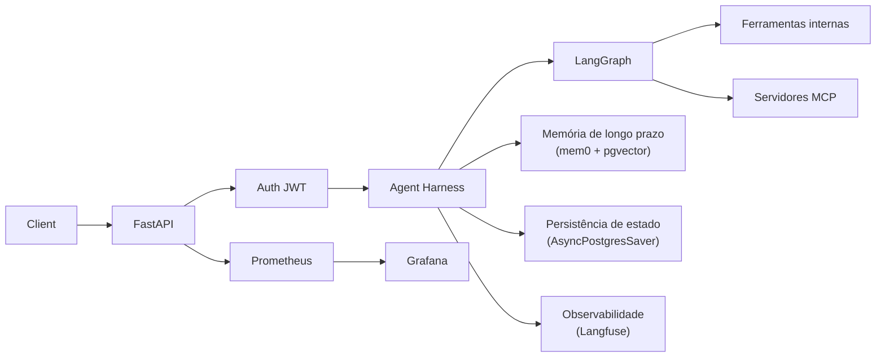
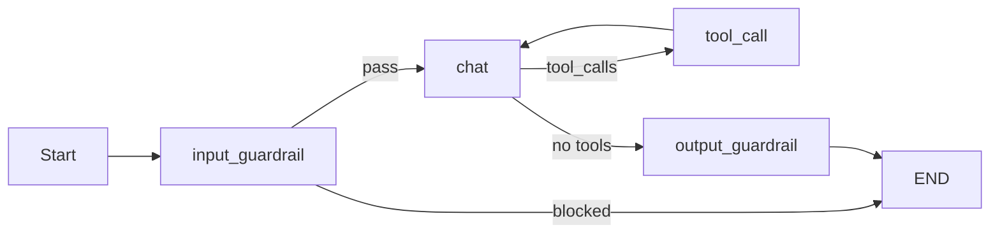

# Construindo um agent harness de IA pronto para produção

A maioria dos tutoriais leva você rapidamente até um agente em notebook: ferramentas, tokens em streaming, talvez uma demonstração bonita. Produção é o restante: autenticação, rate limits, o que fazer quando o modelo ecoa um número de cartão, checagens contra prompt injection na entrada, redação de PII na saída, tracing que permite reproduzir seis chamadas de ferramenta, checkpoints que sobrevivem a restarts, gráficos que explicam um pico de latência às 3h, evals antes de usuários perceberem drift, despejo de ferramentas enormes para fora do contexto e retries com backoff para que um timeout upstream não quebre a sessão. Ninguém entrega essa checklist quando diz "é só usar LangGraph".

A distância entre a demo e algo que você colocaria sob tráfego real é grande. Times ainda acabam reconstruindo a mesma infraestrutura, muitas vezes do zero.

Um agent harness é o nome sem glamour para a casca ao redor do modelo: auth, guardrails, memória, persistência, observabilidade e deployment. É a mesma ideia de um test harness, mas aqui as asserções são políticas e modos de falha. O arquivo do agente guarda o que torna aquele agente diferente; o harness carrega tudo que se repete entre agentes.

Agentes não são funções stateless. Eles mantêm threads, lembram preferências, chamam ferramentas instáveis e emitem texto que precisa ser checado antes de chegar ao cliente. Se você empurra tudo isso para dentro do grafo, o reuso morre e cada novo agente começa como um fork do problema anterior.

Este artigo percorre a arquitetura de um harness assim: LangGraph, FastAPI, Langfuse, PostgreSQL com pgvector, MCP e markdown no estilo skills. O código deste repositório é a referência. Você controla o comportamento do agente; o harness controla as camadas transversais.

Também existe middleware componível de agente (`AgentPipeline`, `AgentMiddleware`): hooks por invocação para logging, erros, memória, guardrails, trimming de contexto e fronteiras de modelo/ferramenta, separados do middleware HTTP do FastAPI. Nomes de hooks, ordenação e diferenças entre o chatbot e Deep Agents estão em [Como o middleware molda um agent harness de produção](./middleware-for-agent-harness.md).



---

## 1. Arquitetura do projeto

Código de agente e infraestrutura ficam em árvores separadas. Visão aproximada:

```text
src/
├── app/
│   ├── agents/              # Diretórios autocontidos de agentes
│   │   ├── chatbot/         # Implementação de agente de referência
│   │   ├── open_deep_research/  # Workflow de pesquisa multiagente
│   │   ├── text_to_sql/     # Agente text-to-SQL
│   │   └── tools/           # Ferramentas compartilhadas (search, think)
│   ├── api/
│   │   ├── v1/              # Rotas versionadas da API
│   │   ├── metrics/         # Middleware Prometheus
│   │   ├── security/        # Auth e rate limiting
│   │   └── logging_context.py
│   └── core/                # Infraestrutura compartilhada
│       ├── middleware/      # Middleware componível de agente (AgentPipeline, hooks)
│       ├── guardrails/      # Segurança de entrada/saída
│       ├── context/         # Prevenção de overflow de contexto LLM
│       ├── memory/          # Memória de longo prazo (mem0)
│       ├── checkpoint/      # Persistência de estado
│       ├── mcp/             # Model Context Protocol
│       ├── metrics/         # Definições Prometheus
│       ├── llm/             # Utilitários de LLM
│       ├── db/              # Conexões de banco
│       └── common/          # Config, logging, modelos
├── evals/                   # Framework de avaliação
├── mcp/                     # Servidor MCP de exemplo
└── cli/                     # Clientes CLI
```

Agentes vivem em diretórios autocontidos em `src/app/agents/`: grafo, prompt e ferramentas. Auth, memória, checkpointing, guardrails, métricas e a stack de middleware de agente em `src/app/core/middleware/` entram por `src/app/core/`.

Três agentes de referência mostram três formatos:

| Agente | Arquitetura | Padrão |
|---|---|---|
| Chatbot | Workflow de grafo customizado | Pipeline linear com loop de ferramentas e nós de guardrail |
| Deep research | Supervisor/researcher multiagente | Subgraphs aninhados com delegação paralela |
| Text-to-SQL | ReAct via Deep Agents | Loop reasoning-action com skills e arquivos de memória |

---

## 2. Abordagens de arquitetura de agentes

Nada obriga um único padrão. Os três agentes são intencionalmente diferentes: grafo explícito pequeno, supervisores aninhados e ReAct empacotado.

### Abordagem 1: workflow de grafo customizado (chatbot)

O chatbot é um `StateGraph` LangGraph escrito manualmente: cada nó e aresta é explícito, o que torna o roteamento óbvio em code review.



O grafo é construído em `_create_graph()`:

```python
async def _create_graph(self) -> StateGraph:
    input_guardrail = create_input_guardrail_node(next_node="chat")
    output_guardrail = create_output_guardrail_node()

    graph_builder = StateGraph(GraphState)
    graph_builder.add_node("input_guardrail", input_guardrail, ends=["chat", END])
    graph_builder.add_node("chat", self._chat_node, ends=["tool_call", "output_guardrail"])
    graph_builder.add_node("tool_call", self._tool_call_node, ends=["chat"])
    graph_builder.add_node("output_guardrail", output_guardrail)
    graph_builder.set_entry_point("input_guardrail")
    graph_builder.add_edge("output_guardrail", END)
    return graph_builder
```

Cada nó retorna um `Command` que controla o roteamento. O nó de chat decide se vai para ferramentas ou para o output guardrail com base na resposta da LLM:

```python
async def _chat_node(self, state: GraphState, config: RunnableConfig) -> Command:
    system_prompt = load_system_prompt(long_term_memory=state.long_term_memory)
    messages = prepare_messages(state.messages, chatbot_model, system_prompt)

    model = chatbot_model.bind_tools(self._get_all_tools()).with_retry(stop_after_attempt=3)

    response_message = await model_invoke_with_metrics(
        model, dump_messages(messages), settings.DEFAULT_LLM_MODEL, self.name, config
    )
    response_message = process_llm_response(response_message)

    goto = "tool_call" if response_message.tool_calls else "output_guardrail"
    return Command(update={"messages": [response_message]}, goto=goto)
```

O schema de estado fica pequeno; o reducer `add_messages` do LangGraph cuida do acúmulo de mensagens:

```python
class GraphState(MessagesState):
    long_term_memory: str
```

System prompts são templates markdown com placeholders preenchidos na invocação:

```markdown
# Name: {agent_name}
# Role: A friendly and professional assistant

## What you know about the user
{long_term_memory}

## Current date and time
{current_date_and_time}
```

Use este padrão quando quiser assistentes ou chatbots em que cada desvio seja um nó deliberado: fácil de diagramar, fácil de alterar e exigente quando o grafo cresce demais.

### Abordagem 2: supervisor/researcher multiagente (deep research)

Deep research aninha subgraphs: um supervisor planeja e delega para subagentes pesquisadores em paralelo. Cada pesquisador é seu próprio LangGraph compilado com um loop estilo ReAct.

```mermaid
flowchart TB
  subgraph main ["Grafo principal"]
    InputGuardrail["input_guardrail"] --> Clarify["clarify_with_user"]
    Clarify --> Brief["write_research_brief"]
    Brief --> Supervisor["research_supervisor\n(subgraph)"]
    Supervisor --> FinalReport["final_report_generation"]
    FinalReport --> OutputGuardrail["output_guardrail"]
  end

  subgraph supervisor ["Subgraph supervisor"]
    SupervisorNode["supervisor"] --> SupervisorTools["supervisor_tools"]
    SupervisorTools -->|"ConductResearch"| ResearcherGraph["researcher\n(subgraph, paralelo)"]
    SupervisorTools -->|"think_tool"| SupervisorNode
    ResearcherGraph --> SupervisorNode
    SupervisorTools -->|"ResearchComplete"| SupervisorEnd["END"]
  end

  subgraph researcher ["Subgraph researcher"]
    ResearcherNode["researcher"] --> ResearcherTools["researcher_tools"]
    ResearcherTools -->|"continue"| ResearcherNode
    ResearcherTools -->|"done"| Compress["compress_research"]
  end
```



O grafo principal compõe esses subgraphs como nós:

```python
def _build_deep_research_graph(self) -> StateGraph:
    deep_researcher_builder = StateGraph(AgentState, input=AgentInputState)

    deep_researcher_builder.add_node("input_guardrail", input_guardrail, ends=["clarify_with_user", END])
    deep_researcher_builder.add_node("clarify_with_user", clarify_with_user)
    deep_researcher_builder.add_node("write_research_brief", write_research_brief)
    deep_researcher_builder.add_node("research_supervisor", self.supervisor_subagent.get_graph())
    deep_researcher_builder.add_node("final_report_generation", final_report_generation)
    deep_researcher_builder.add_node("output_guardrail", output_guardrail)

    deep_researcher_builder.add_edge("research_supervisor", "final_report_generation")
    deep_researcher_builder.add_edge("final_report_generation", "output_guardrail")
    deep_researcher_builder.add_edge("output_guardrail", END)
    return deep_researcher_builder
```

O supervisor delega tarefas de pesquisa em paralelo usando `asyncio.gather`:

```python
research_tasks = [
    self._researcher_agent.agent_invoke({
        "researcher_messages": [HumanMessage(content=tool_call["args"]["research_topic"])],
        "research_topic": tool_call["args"]["research_topic"]
    }, "session_id_placeholder", 1)
    for tool_call in allowed_conduct_research_calls
]
tool_results = await asyncio.gather(*research_tasks)
```

Cada researcher roda seu próprio loop ReAct: ferramentas de busca, `think_tool`, até `MAX_REACT_TOOL_CALLS`, depois comprime o resultado em um resumo.

Use isso para pesquisa ou análise em que o trabalho pode ser dividido em partes paralelas mantendo limites claros de subgraph.

### Abordagem 3: ReAct com Deep Agents (text-to-SQL)

Text-to-SQL evita desenhar grafos manualmente e usa o pacote Deep Agents (`deepagents`): um loop ReAct com skills markdown e arquivos de memória em disco.

```python
def create_sql_deep_agent():
    db = SQLDatabase.from_uri(f"sqlite:///{db_path}", sample_rows_in_table_info=3)
    model = ChatOpenAI(model="gpt-5-mini", reasoning={"effort": "medium"}, temperature=0)

    toolkit = SQLDatabaseToolkit(db=db, llm=model)
    sql_tools = toolkit.get_tools()

    agent = create_deep_agent(
        model=model,
        memory=["./AGENTS.md"],
        skills=["./skills/"],
        tools=sql_tools,
        subagents=[],
        backend=FilesystemBackend(root_dir=base_dir),
    )
    return agent
```

A configuração fica mais em markdown do que em Python:

- `AGENTS.md`: identidade, papel, regras de segurança (SQL read-only), hábitos de planejamento.
- `skills/`: descrições de workflow (exploração de schema, escrita de queries).
- `FilesystemBackend`: espaço de rascunho para resultados intermediários e planos.

Uma skill é um arquivo markdown que diz quando usá-la e quais passos seguir. O modelo vê descrições curtas no contexto e carrega o corpo longo apenas quando a tarefa combina. Isso evita colocar todo procedimento no system prompt.

Exemplo de skill de exploração de schema:

```markdown
---
name: schema-exploration
description: For discovering and understanding database structure, tables, columns, and relationships
---

## When to Use This Skill
Use this skill when you need to:
- Understand the database structure
- Find which tables contain certain types of data
- Discover column names and data types

## Workflow
### 1. List All Tables
Use `sql_db_list_tables` tool to see all available tables in the database.

### 2. Get Schema for Specific Tables
Use `sql_db_schema` tool with table names to examine columns, data types, and relationships.
```

Isso é divulgação progressiva: títulos e resumos ficam prontos no contexto, e instruções completas entram sob demanda. Perguntas simples continuam baratas; perguntas difíceis ainda ganham checklist. Muitas vezes, novo comportamento é um `.md` em `skills/`, não uma edição de grafo.

A classe wrapper aplica os mesmos guardrails do harness (content filter, bloqueio de PII, safety check de saída) antes e depois do loop ReAct:

```python
class TextSQLDeepAgent:
    async def agent_invoke(self, agent_input, session_id, user_id=None):
        query = agent_input.get("query", "")

        filter_result = check_content_filter(query)
        if filter_result.is_blocked:
            return [Message(role="assistant", content="I cannot process this request.")]

        pii_findings = detect_pii(query, pii_types=[PIIType.API_KEY, PIIType.SSN, PIIType.CREDIT_CARD])
        if pii_findings:
            return [Message(role="assistant", content="Your message contains sensitive information.")]

        response = await self.agent.ainvoke({"messages": [{"role": "user", "content": query}]}, config=config)
        messages = process_messages(response["messages"])
        await self.process_safe_output(messages)
        return messages
```

Use isso quando o procedimento for mais fácil de explicar em prosa do que em nós e você puder aceitar que o agente escolha sua própria ordem (schema, query, correção, repetição) sem enumerar cada caminho.

### Comparação de arquitetura

| Dimensão | Grafo customizado | Subgraphs multiagente | ReAct (Deep Agents) |
|---|---|---|---|
| Controle | Total; cada aresta é explícita | Hierárquico; limites de delegação | Fino; o agente escolhe o caminho |
| Debuggability | Alta; fluxo determinístico | Média; fronteiras de subgraph visíveis | Menor; comportamento emerge |
| Paralelismo | Manual | Integrado via supervisor | Principalmente sequencial |
| Flexibilidade | Editar nós no código | Compor subgraphs | Ajustar markdown e tools |
| Melhor para | Chat, loops controlados | Pesquisa, trabalho paralelizável | SQL, APIs, kits de domínio |

Todos compartilham a mesma infraestrutura do harness: guardrails, tracing Langfuse, métricas Prometheus, logging estruturado e autenticação. A escolha de arquitetura só afeta o que vive dentro de `src/app/agents/<your_agent>/`.

---

## 3. Guardrails: segurança de entrada e saída

Guardrails são factory functions que retornam nós compatíveis com LangGraph, permitindo que cada agente ajuste as checagens sem copiar boilerplate.

### Guardrails de entrada

Checagens determinísticas rodam antes do modelo ver o texto do usuário:

```python
def create_input_guardrail_node(
    next_node: str,
    banned_keywords: list[str] | None = None,
    pii_check_enabled: bool = True,
    prompt_injection_check: bool = True,
    block_pii_types: list[PIIType] | None = None,
) -> Callable:
```

Duas camadas, nesta ordem:

1. Filtro de conteúdo: palavras proibidas e regexes de prompt injection.
2. Detecção de PII: regex para SSN, API keys, cartões etc., com Luhn para cartões.

Quando a entrada é bloqueada, o guardrail roteia direto para `END` com mensagem de rejeição:

```python
if filter_result.is_blocked:
    return Command(
        update={"messages": [AIMessage(content=BLOCKED_INPUT_MESSAGE)]},
        goto=END,
    )
```

### Guardrails de saída

Antes do cliente ver a resposta:

1. Redação determinística de PII para tokens como `[REDACTED_EMAIL]` / `[REDACTED_SSN]`, com modos redact, mask, hash ou block.
2. Um modelo pequeno e barato classifica `SAFE` vs `UNSAFE`; texto inseguro é substituído por uma resposta padrão.

```python
async def evaluate_safety(content: str) -> bool:
    model = _get_safety_model()
    prompt = SAFETY_EVALUATION_PROMPT.format(response=content[:2000])
    result = await model.ainvoke([{"role": "user", "content": prompt}])
    verdict = result.content.strip().upper()
    return "UNSAFE" not in verdict
```

O output guardrail falha aberto: se o modelo de safety quebrar, a resposta ainda sai. Isso troca rigor por disponibilidade; só endureça se aceitar bloquear respostas quando o avaliador estiver fora.

---

## 4. Memória de longo prazo (mem0 + pgvector)

Memória semântica por usuário fica no pgvector. Cada invocação busca memórias similares primeiro e, depois da execução, extrai novas memórias da conversa.

```python
async def get_relevant_memory(user_id: int, query: str) -> str:
    memory = await get_memory_instance()
    results = await memory.search(user_id=str(user_id), query=query)
    return "\n".join([f"* {result['memory']}" for result in results["results"]])
```

Atualizações de memória rodam em background para não bloquear a resposta:

```python
def bg_update_memory(user_id: int, messages: list[dict], metadata: dict = None) -> None:
    asyncio.create_task(update_memory(user_id, messages, metadata))
```

Formato típico de `agent_invoke`: lê memória, roda o grafo, dispara atualização sem esperar:

```python
async def agent_invoke(self, messages, session_id, user_id=None):
    relevant_memory = (await get_relevant_memory(user_id, messages[-1].content)) or "No relevant memory found."
    agent_input = {"messages": dump_messages(messages), "long_term_memory": relevant_memory}

    response = await self._graph.ainvoke(input=agent_input, config=config)
    bg_update_memory(user_id, messages_dic, {"session_id": session_id, "agent_name": self.name})
    return result
```

O singleton de memória conecta ao pgvector usando a mesma instância PostgreSQL do restante da aplicação, configurada pela classe compartilhada `Settings`.

---

## 5. Gerenciamento de contexto

Threads longas e payloads grandes de ferramentas estouram a janela de contexto. `src/app/core/context/` faz duas coisas: despeja blobs enormes de ferramentas imediatamente e resume histórico antes que o modelo engasgue.

### Camada 1: despejo de resultado de ferramenta

Quando uma ferramenta retorna resultado acima de um limite grande, o conteúdo completo é salvo em markdown e substituído por um ponteiro curto. Assim, o histórico permanece auditável, mas não ocupa todo o contexto da LLM.

### Camada 2: sumarização antes do modelo

O chatbot chama `summarize_if_too_long` antes de preparar mensagens:

```python
async def _chat_node(self, state: GraphState, config: RunnableConfig) -> Command:
    condensed_messages = await summarize_if_too_long(
        messages=state.messages,
        model_name=f"openai:{settings.DEFAULT_LLM_MODEL}",
        llm=chatbot_model,
        session_id=config["configurable"]["thread_id"],
    )

    system_prompt = load_system_prompt(long_term_memory=state.long_term_memory)
    messages = prepare_messages(condensed_messages, chatbot_model, system_prompt)
```

A função não faz nada quando o contexto está dentro do orçamento. Quando dispara, procede em etapas:

1. Trunca argumentos enormes de tool calls antigas sem chamar LLM.
2. Se ainda estiver grande, separa mensagens antigas e recentes em uma fronteira limpa de `HumanMessage`.
3. Salva o bloco antigo em markdown e substitui por um resumo gerado por LLM.

Se a sumarização falhar, a função cai para uma listagem simples de papéis de mensagens, permitindo que a conversa continue. As mensagens antigas completas são preservadas no arquivo markdown independentemente do sucesso do resumo.

---

## 6. Persistência de estado (checkpointing)

`AsyncPostgresSaver` grava o estado completo do grafo após cada nó, então um restart não apaga a thread e você pode retomar um fluxo no meio.

```python
async def get_checkpointer():
    connection_pool = await get_connection_pool()
    if connection_pool:
        checkpointer = AsyncPostgresSaver(connection_pool)
        await checkpointer.setup()
    else:
        checkpointer = None
        if settings.ENVIRONMENT != Environment.PRODUCTION:
            raise Exception("Connection pool initialization failed")
    return checkpointer
```

O checkpointer é compilado no grafo uma vez e reutilizado:

```python
self._graph = graph_builder.compile(checkpointer=self.checkpointer, name=self.name)
```

Toda invocação passa um `thread_id` (o ID da sessão) para o LangGraph saber qual conversa retomar:

```python
config["configurable"] = {"thread_id": session_id}
```

Quando o usuário exclui uma sessão, o harness limpa as tabelas de checkpoint.

---

## 7. Autenticação e sessões

Auth JWT com uma sessão por conversa: registrar, logar para obter um token de usuário e criar uma linha de sessão por thread.

Endpoints protegidos usam dependency injection do FastAPI:

```python
@router.post("/chat", response_model=ChatResponse)
@limiter.limit(settings.RATE_LIMIT_ENDPOINTS["chat"][0])
async def chat(
    request: Request,
    chat_request: ChatRequest,
    session: Session = Depends(get_current_session),
):
```

Rate limiting é configurado por endpoint via variáveis de ambiente:

```python
default_endpoints = {
    "chat": ["30 per minute"],
    "chat_stream": ["20 per minute"],
    "deep_research": ["10 per minute"],
    "register": ["10 per hour"],
    "login": ["20 per minute"],
}
```

Inputs têm HTML removido, `<script>` descartado e null bytes filtrados tanto na validação quanto na camada de API.

---

## 8. Observabilidade

Tracing, métricas e logs são sistemas separados; a app conecta os três.

### Tracing Langfuse

Toda chamada de LLM é rastreada via Langfuse por um callback handler injetado na config do agente:

```python
self._config = {
    "callbacks": [langfuse_callback_handler],
    "metadata": {
        "environment": settings.ENVIRONMENT.value,
        "debug": settings.DEBUG,
    },
}
```

Você obtém a cadeia de chamadas de modelo, ferramentas, tokens e latência por turno a partir dos callbacks no invoke config, sem espalhar chamadas de tracing na lógica de negócio.


### Métricas Prometheus

Histograms e counters cobrem ruído de infraestrutura e tempos específicos de LLM:

```python
llm_inference_duration_seconds = Histogram(
    "llm_inference_duration_seconds",
    "Time spent processing LLM inference",
    ["model", "agent_name"],
    buckets=[0.1, 0.3, 0.5, 1.0, 2.0, 5.0]
)

tool_executions_total = Counter(
    "tool_executions_total",
    "Total tool executions",
    ["tool_name", "status"]
)
```

Toda chamada de LLM passa por `model_invoke_with_metrics()`, que mede a inferência e registra uso de tokens:

```python
async def model_invoke_with_metrics(model, model_input, model_name, agent_name, config=None):
    with llm_inference_duration_seconds.labels(model=model_name, agent_name=agent_name).time():
        response = await model.ainvoke(model_input, config)
    record_token_usage(response, model_name, agent_name)
    return response
```

`MetricsMiddleware` registra duração HTTP, contagens e status codes por rota.


### Logging estruturado

structlog em todos os lugares: nomes de evento em `snake_case`, kwargs em vez de f-strings no texto do evento, facilitando filtro em Loki ou similares.

```python
logger.info("chat_request_received", session_id=session.id, message_count=len(messages))
```

Um `LoggingContextMiddleware` extrai `session_id` e `user_id` do JWT em cada request e vincula ao contexto de logging. Em desenvolvimento, imprime linhas coloridas; em produção, emite JSON. Mesmos caminhos de código, renderer diferente.

---

## 9. FastAPI: rotas síncronas no contrato e SSE

Chat tem request/response e streaming SSE via `StreamingResponse` e gerador assíncrono:

```python
@router.post("/chat/stream")
@limiter.limit(settings.RATE_LIMIT_ENDPOINTS["chat_stream"][0])
async def chat_stream(request, chat_request, session=Depends(get_current_session)):
    agent = await get_agent_example()

    async def event_generator():
        full_response = ""
        async for chunk in agent.agent_invoke_stream(
            chat_request.messages, session.id, user_id=session.user_id
        ):
            full_response += chunk
            response = StreamResponse(content=chunk, done=False)
            yield f"data: {json.dumps(response.model_dump())}\n\n"

        final_response = StreamResponse(content="", done=True)
        yield f"data: {json.dumps(final_response.model_dump())}\n\n"

    return StreamingResponse(event_generator(), media_type="text/event-stream")
```

Startup usa um contexto de lifespan (init/cleanup de MCP, logging), não vários hooks `@app.on_event` espalhados.

---

## 10. MCP (Model Context Protocol)

Ferramentas podem vir de servidores MCP. Sessões sobem no startup da app e vivem pelo tempo de vida do processo, evitando handshake por request.

```python
class MCPSessionManager:
    async def initialize(self) -> Resource:
        self._exit_stack = AsyncExitStack()
        await self._exit_stack.__aenter__()

        tools, sessions = [], []
        for hostname in settings.MCP_HOSTNAMES:
            session = await self._exit_stack.enter_async_context(
                mcp_sse_client(hostname, correlation_id=generate_correlation_id())
            )
            session_tools = await load_mcp_tools(session)
            tools.extend(session_tools)
            sessions.append(session)

        self._resource = Resource(tools=tools, sessions=sessions)
        return self._resource
```

Notas operacionais:

- Múltiplos hosts via `MCP_HOSTNAMES_CSV`.
- Reconexão com backoff em `ClosedResourceError`.
- Se MCP cair, o chatbot ainda roda com ferramentas internas (degradado, não morto).
- Correlation IDs em chamadas MCP para alinhar traces e logs.

Ferramentas MCP são carregadas uma vez e mescladas com ferramentas internas quando o grafo é compilado:

```python
def _get_all_tools(self) -> list[BaseTool]:
    return self.tools + list(self.mcp_tools_by_name.values())
```

---

## 11. Avaliações (LLM-as-judge)

Evals leem traces Langfuse, pontuam com um modelo juiz e escrevem os scores de volta. Definições de métricas são markdown em `src/evals/metrics/prompts/`; um novo `.md` é carregado automaticamente. Os prompts padrão cobrem relevancy, helpfulness, conciseness, hallucination e toxicity.

Cada prompt de métrica instrui a LLM avaliadora a pontuar a saída em uma escala de 0 a 1:

```markdown
Evaluate the relevancy of the generation on a continuous scale from 0 to 1.

## Scoring Criteria
A generation can be considered relevant (Score: 1) if it:
- Directly addresses the user's specific question or request
- Provides information that is pertinent to the query
- Stays on topic without introducing unrelated information
```

O avaliador busca traces sem score das últimas 24 horas, roda cada métrica e envia scores ao Langfuse:

```python
class Evaluator:
    async def run(self, generate_report_file=True):
        traces = self.__fetch_traces()
        for trace in tqdm(traces, desc="Evaluating traces"):
            for metric in metrics:
                input, output = get_input_output(trace)
                score = await self._run_metric_evaluation(metric, input, output)
                if score:
                    self._push_to_langfuse(trace, score, metric)
```

Structured outputs da OpenAI mantêm o juiz retornando score numérico e raciocínio:

```python
class ScoreSchema(BaseModel):
    score: float  # 0-1
    reasoning: str
```

Relatórios são salvos como JSON com médias por métrica e detalhamento por trace. Rode avaliações com:

```bash
make eval              # modo interativo
make eval-quick        # configurações padrão, sem prompts
make eval-no-report    # pula geração de relatório
```

---

## 12. Configuração

Settings são mescladas a partir de arquivos nesta ordem (os últimos vencem):

```text
.env.{environment}.local  (maior prioridade, gitignored)
.env.{environment}
.env.local
.env                      (menor prioridade)
```

Quatro ambientes nomeados (`development`, `staging`, `production`, `test`) vêm com defaults que você pode sobrescrever em `.env` ou no ambiente do host:

```python
env_settings = {
    Environment.DEVELOPMENT: {
        "DEBUG": True, "LOG_LEVEL": "DEBUG", "LOG_FORMAT": "console",
        "RATE_LIMIT_DEFAULT": ["1000 per day", "200 per hour"],
    },
    Environment.PRODUCTION: {
        "DEBUG": False, "LOG_LEVEL": "WARNING",
        "RATE_LIMIT_DEFAULT": ["200 per day", "50 per hour"],
    },
}
```

Variáveis reais de ambiente sempre vencem os defaults embutidos, permitindo ajustar um cluster sem forkar o repo.

---

## 13. Docker e Compose

Imagem Python slim, usuário não-root e script de entrypoint:

```dockerfile
FROM python:3.13.2-slim

COPY ../pyproject.toml .
RUN uv venv && . .venv/bin/activate && uv pip install -e .

COPY .. .
RUN useradd -m appuser && chown -R appuser:appuser /app
USER appuser

ENTRYPOINT ["/app/scripts/docker-entrypoint.sh"]
CMD ["/app/.venv/bin/uvicorn", "src.app.main:app", "--host", "0.0.0.0", "--port", "8000"]
```

Compose sobe Postgres (com pgvector), Prometheus coletando `/metrics`, dashboards Grafana (latência, tempo de LLM, tokens, rate limits) e cAdvisor para estatísticas dos containers.

Targets do Makefile encapsulam tarefas do dia a dia:

```bash
make dev                               # inicia servidor de desenvolvimento
make test                              # roda pytest
make eval                              # roda avaliações
make docker-build-env ENV=production   # build da imagem Docker
make docker-compose-up ENV=development # stack completa
make lint                              # Ruff check e format
```

---

## 14. Adicionando seu próprio agente

Um diretório por agente. Escolha o formato da seção 2 que combina com o nível de controle necessário, copie o agente de referência mais próximo e remova o que não usar.

### Passo 1: crie o diretório do agente

```text
src/app/agents/my_agent/
  __init__.py          # factory function
  agent.py             # classe do agente com definição de grafo
  system.md            # template de system prompt (ou AGENTS.md para ReAct)
  tools/
    __init__.py        # exporta lista de tools
    my_tool.py         # implementações customizadas
```

### Passo 2: escolha a arquitetura

- Grafo customizado (chatbot): `StateGraph` explícito quando você quer cada aresta no código.
- Subgraphs multiagente (deep research): compile subgraphs e conecte ao grafo pai quando o trabalho se divide bem.
- ReAct / Deep Agents (text-to-SQL): `create_deep_agent` mais markdown e toolkits quando prosa é melhor que nós.

### Passo 3: defina o system prompt

Para agentes baseados em grafo, `system.md` suporta `{long_term_memory}` e `{current_date_and_time}`, além de kwargs customizados:

```markdown
# Name: {agent_name}
# Role: A domain-specific assistant

Your specific instructions here.

## What you know about the user
{long_term_memory}

## Current date and time
{current_date_and_time}
```

Para agentes ReAct, use `AGENTS.md` para definir identidade, regras e estratégias de planejamento em linguagem natural.

### Passo 4: crie a classe do agente

Siga o padrão do agente de referência que combina com a arquitetura escolhida. No mínimo, implemente `agent_invoke` e, opcionalmente, `agent_invoke_stream` para SSE. Aplique guardrails como nós de grafo (custom graph / subgraph) ou como lógica wrapper (ReAct):

```python
class MyAgent:
    def __init__(self, name, tools, checkpointer):
        self.name = name
        self.tools = tools
        self.checkpointer = checkpointer

    async def compile(self):
        graph_builder = await self._create_graph()
        self._graph = graph_builder.compile(checkpointer=self.checkpointer, name=self.name)
```

### Passo 5: conecte a um endpoint de API

Crie uma rota em `src/app/api/v1/` seguindo o padrão do chatbot:

```python
@router.post("/chat", response_model=ChatResponse)
@limiter.limit(settings.RATE_LIMIT_ENDPOINTS["my_endpoint"][0])
async def chat(request: Request, chat_request: ChatRequest, session=Depends(get_current_session)):
    agent = await get_my_agent()
    result = await agent.agent_invoke(chat_request.messages, session.id, user_id=session.user_id)
    return ChatResponse(messages=result)
```

Auth, leitura/escrita de memória, checkpoints, métricas, tracing, guardrails e middleware de agente ficam fora do diretório do seu agente. Veja detalhes em [middleware-for-agent-harness.md](./middleware-for-agent-harness.md).

---

## 15. Checklist

| Preocupação | Implementação |
|---|---|
| Autenticação | JWT, sessão por conversa |
| Guardrails de entrada | Content filter, padrões de injection, bloqueio de PII |
| Guardrails de saída | Modos de redação, modelo pequeno de safety |
| Middleware de agente | `AgentPipeline` / `AgentMiddleware` em `src/app/core/middleware/`; [walkthrough](./middleware-for-agent-harness.md) |
| Memória de longo prazo | mem0 + pgvector, por usuário, update async |
| Contexto | Despejo de ferramentas para disco, sumarização em duas etapas |
| Estado | `AsyncPostgresSaver`, thread id = sessão |
| Observabilidade | Langfuse, Prometheus, structlog |
| Rate limiting | slowapi por rota, ajustável por env |
| Erros | Retries, backoff, caminhos de degradação para MCP e modelo |
| Streaming | Stream SSE de tokens |
| Avaliação | Juiz sobre traces Langfuse, métricas markdown |
| Deployment | Docker non-root, stack Compose |
| MCP | Multi-host, reconexão, fallback interno |
| Formatos de agente | Grafo customizado, supervisores aninhados, Deep Agents |

A parte difícil da produção raramente é o prompt esperto. É auth, segurança, memória, checkpoints, observabilidade e modos de falha. Um harness permite resolver isso uma vez e manter o código do agente focado no comportamento: um loop de chat enxuto, uma pesquisa com fan-out ou um agente SQL ReAct podem todos se apoiar na mesma base.

O código-fonte está neste repositório se você quiser fazer fork e trocar os agentes de referência pelos seus.
