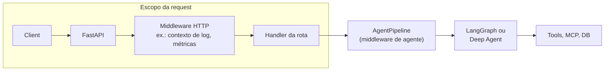
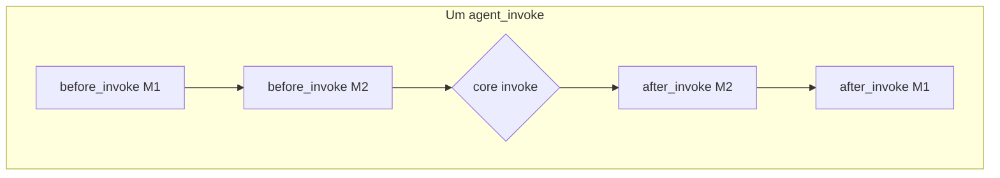

# Como o Middleware Molda um Agent Harness de Produção

Um agent harness é a cola entre um modelo de linguagem e todo o resto: ferramentas, dados, memória e a fronteira request/response da sua aplicação. No centro, há uma LLM em loop chamando ferramentas. Produção nunca é apenas esse loop. Você quer políticas que sempre rodam, contexto com tamanho controlado, logs e métricas, e comportamento previsível quando algo quebra.

Este documento trata do middleware de agentes neste repositório: uma camada componível ao redor das invocações. Ela fica separada da stack HTTP e do grafo bruto LangGraph ou Deep Agents. A ideia é parecida com o que costuma ser chamado de "agent middleware" em stacks estilo LangChain: hooks ao redor do loop, ordenação componível e espaço tanto para defaults do framework quanto para seu próprio código. O código vive em `src/app/core/middleware/`; os exemplos se referem a essa árvore, não a tutoriais genéricos.

Para a história mais ampla do harness (FastAPI, auth, checkpointing, mem0, Langfuse, MCP e o restante), veja [ARTICLE.md](./ARTICLE.md).

---

## O Que "Harness" Significa Aqui

Não existe uma única classe chamada "harness". Nesta stack, ele é a soma de três coisas:

- Comportamento de API e cross-request: JWT, rate limits, métricas, logging com escopo de request.
- Comportamento do agente por invocação: grafos, ferramentas, memória, guardrails.
- Middleware de agente: um pipeline ao redor de cada `agent_invoke` e, quando conectado, ao redor de cada etapa de modelo e ferramenta dentro de um grafo.

O loop ainda é o normal: o modelo propõe ações, ferramentas rodam, o estado atualiza, repete. Middleware é onde você pendura comportamentos que, de outro modo, seriam copiados em todo nó.

---

## Por Que Mexer no Harness?

Prompts, listas de ferramentas e escolha de modelo são fáceis de variar por agente. Outras necessidades aparecem em toda etapa: bloquear ou redigir PII, aparar ou resumir contexto antes do modelo rodar, logar nomes de ferramentas, incrementar métricas de erro, carregar e atualizar memória de longo prazo. Se você espalha blocos `if` por cada nó, o grafo fica difícil de testar e reutilizar.

A resposta deste projeto é middleware de agente: uma superfície pequena de hooks e um pipeline por agente, com uma lista ordenada de classes de middleware.

---

## Nomes dos Hooks: Outros Lugares vs. Este Repositório

Você pode ver `before_agent`, `before_model`, `wrap_model_call`, `wrap_tool_call`, `after_agent` em outras documentações. Aqui, o contrato é a classe abstrata [`AgentMiddleware`](../src/app/core/middleware/types.py) em `src/app/core/middleware/types.py`. Mesma ideia geral, nomes diferentes. Mapeamento aproximado:

| Ideia | Neste codebase | Uso típico |
|------|----------------|------------|
| Uma vez no início da invocação | `before_invoke` | Carregar memória, validar input, interromper requests ruins (resultado antecipado, pula grafo). |
| Uma vez depois do grafo retornar | `after_invoke` (roda em ordem inversa de registro) | Pós-processar mensagens finais, atualizar memória em background. |
| Antes de cada chamada de LLM | `before_model_call` | Resumir ou aparar histórico de mensagens, logging estruturado. |
| Depois de cada resposta da LLM | `after_model_call` | Logging ou pós-processamento da mensagem do modelo. |
| Antes de cada execução de ferramenta | `before_tool_call` | Observar ou ajustar argumentos da ferramenta. |
| Depois de cada resultado de ferramenta | `after_tool_call` | Observar ou transformar saída da ferramenta. |
| Em exceção do grafo | `on_error` | Resultado vazio seguro em produção ou relançar em dev. |
| Wrapper fim a fim de modelo ou ferramenta | Sem `wrap_model_call` / `wrap_tool_call` único | Combine `before_*` e `after_*`, mais helpers de call-site como `model_invoke_with_metrics` e `.with_retry()` no chatbot. |

`before_model_call` e `after_model_call` só rodam se o nó do grafo que fala com o modelo passar pelo `MiddlewareManager` do pipeline. O chatbot faz isso em `_chat_node` e `_tool_call_node` via `self._pipeline.manager` e `run_before_model_call`, `run_after_model_call`, `run_before_tool_call`, `run_after_tool_call`. Isso é cooperativo: o pipeline e os nós concordam com o contrato. Middleware não é implícito. Agentes com loop fechado (por exemplo Deep Agents de `create_deep_agent`) não recebem esses hooks por etapa a menos que o framework os chame; este repo envolve o `ainvoke` inteiro em um `AgentPipeline` externo e ainda pode anexar `middleware` do LangChain no agente interno quando necessário.

O estado da invocação vive em [`AgentContext`](../src/app/core/middleware/types.py): `messages`, `session_id`, `user_id`, `config` (callbacks Langfuse, thread id via `build_invoke_config`), `agent_name` e um dict `metadata` que middlewares podem ler e escrever (por exemplo `long_term_memory` do `MemoryMiddleware`).

[`MiddlewareManager`](../src/app/core/middleware/pipeline.py) roda `before_*` na ordem de registro e `after_*` na ordem inversa, com sensação parecida com stacks de middleware HTTP.

---

## `AgentPipeline` e `MiddlewareManager`

[`AgentPipeline`](../src/app/core/middleware/pipeline.py) recebe uma lista de instâncias de middleware e uma `invoke_fn` (a chamada central do grafo ou agente). `run`:

1. Define `active_ctx` no manager para que nós possam ler o `AgentContext` atual.
2. Roda `run_before_invoke`; se qualquer middleware retornar algo diferente de `None`, o grafo é pulado (short-circuit de guardrail).
3. Chama a função central; em exceção, roda `on_error` até algo retornar um resultado, ou a exceção subir.
4. Roda `run_after_invoke` em ordem inversa.
5. Limpa `active_ctx` em `finally`.

Isso dá um único lugar para logging, política de erro e memória sem duplicar lógica entre agentes.

---

## Exemplos Deste Repositório

Abaixo está como a árvore é realmente usada, não um walkthrough de terceiros.

### Lógica de Negócio e Compliance

Algumas regras não devem viver apenas em prompt. Política de conteúdo e tratamento de PII são determinísticos e devem rodar em toda request.

- [`GuardrailMiddleware`](../src/app/core/middleware/guardrail_middleware.py): `before_invoke` (content filter, bloqueio de alguns tipos de PII na entrada), `after_invoke` (redação de PII na saída do assistente, safety check assíncrono opcional). Ele pode retornar cedo em `before_invoke`, então o modelo nunca roda em input proibido.
- O agente text-to-SQL usa o mesmo pipeline externo para logging, erros e guardrails, e passa `PIIMiddleware("email")` do LangChain para `create_deep_agent` em `src/app/agents/text_to_sql/text_sql_agent.py`. Middleware em nível de harness envolve a invocação inteira; middleware do framework fica dentro do loop do Deep Agent para email.

Compliance não é algo para "colocar no prompt"; pertence ao harness.

### Gerenciamento de Contexto

Contexto ruim entra, resposta ruim sai. Este projeto usa `before_model_call` para manter o histórico dentro do orçamento:

- [`SummarizationMiddleware`](../src/app/core/middleware/summarization_middleware.py) chama `summarize_if_too_long` de `src/app/core/context/` para comprimir histórico longo antes do modelo rodar.
- [`TrimLongMessagesMiddleware`](../src/app/core/middleware/trim_long_messages_middleware.py) usa `trim_messages` do LangChain com estratégia `"last"`, preservando mensagens recentes quando a lista está longa demais.

O chatbot registra ambos em `AgentChatbot`, junto com memória e logging (`src/app/agents/chatbot/agent_chatbot.py`).

- [`MemoryMiddleware`](../src/app/core/middleware/memory_middleware.py): `before_invoke` roda `get_relevant_memory` e define `ctx.metadata["long_term_memory"]`; `after_invoke` roda `bg_update_memory` a partir das mensagens retornadas. Recuperação e escrita de memória ficam fora da lógica de roteamento do grafo.

### Controle Dinâmico (tools, modelo, prompt)

"Trocar ferramentas em runtime" ou "escolher um subconjunto por turno" aqui é principalmente estrutura do grafo e carregamento de tools (ferramentas MCP no chatbot, por exemplo), não uma classe dedicada de middleware seletor. Você estende adicionando um `AgentMiddleware` ou adicionando nós e arestas. Middleware fica enxuto para regras transversais; roteamento fica no grafo, onde é visível.

### Comportamento de Produção

Coisas que demos pulam, mas operação cobra:

- [`ErrorHandlingMiddleware`](../src/app/core/middleware/error_handling_middleware.py): `on_error`, métricas de erro de LLM e, em ambientes não-dev, resultado vazio em vez de vazar stack traces para o cliente.
- [`LoggingMiddleware`](../src/app/core/middleware/logging_middleware.py): início/fim de invocação; em debug, fronteiras de modelo e ferramenta com `structlog` e campos como `agent_name`, `session_id`.
- Chamadas de LLM frequentemente passam por `model_invoke_with_metrics` em `src/app/core/metrics/`; o chatbot envolve o modelo com `.with_retry()` para APIs instáveis. A mesma história operacional do middleware, mas parte dela vive no call site e também em `on_error`.

### Ambiente ao Redor do Loop

Outros textos descrevem middleware que sobe um shell para a execução. Aqui, o primo próximo é MCP: sessões e ferramentas são configuradas fora do loop central e depois usadas pelos nós do grafo. Veja `_load_mcp_tools` e `handle_mcp_tool_call` em `src/app/agents/chatbot/agent_chatbot.py` e `src/app/core/mcp/`. Isso não é implementado como middleware `before_invoke` / `after_invoke` nesta árvore, mas atende à mesma necessidade: recursos estáveis que o agente pode reutilizar entre turnos.

---

## Deep Agents Mais um Pipeline Externo

Deep Agents (via `deepagents`) trazem um loop completo com bons defaults. Em `TextSQLDeepAgent`, `create_sql_deep_agent()` passa para `create_deep_agent` um modelo, tools SQL, backend de filesystem, skills e `PIIMiddleware` do LangChain no agente interno. `TextSQLDeepAgent` então envolve `agent.ainvoke` em `AgentPipeline` com `LoggingMiddleware`, `ErrorHandlingMiddleware` e `GuardrailMiddleware`.

Você termina com duas camadas: políticas do harness em todo `agent_invoke` e middleware do framework dentro do deep agent. O caminho customizado do chatbot usa um LangGraph explícito e conecta hooks por etapa de modelo e ferramenta ao `MiddlewareManager`, o que dá mais controle e mais código de nó.

---

## Por Que Manter Esta Abstração?

Modelos continuarão melhorando; parte do trimming de contexto de hoje pode se aproximar do modelo com o tempo. O que não vive nos pesos é política: o que a organização permite, o que você loga, como falha e como reutiliza essas regras entre agentes. Middleware separa essas preocupações em classes pequenas com ordem definida e evita que prompts, ferramentas e código de grafo virem um despejo de infraestrutura.

Comportamento compartilhado vive em `src/app/core/middleware/`; agentes em `src/app/agents/` escolhem sua stack quando constroem `AgentPipeline`. Comece por `src/app/core/middleware/__init__.py` para exports e [`pipeline.py`](../src/app/core/middleware/pipeline.py) para a ordem de execução; depois leia os agentes chatbot e text-to-SQL para ver os dois estilos de integração.

---

## Leitura Complementar

- [Construindo um agent harness de IA pronto para produção](./ARTICLE.md): middleware HTTP, auth, memória, observabilidade e o restante.
- Tipos e runner: [`src/app/core/middleware/types.py`](../src/app/core/middleware/types.py), [`src/app/core/middleware/pipeline.py`](../src/app/core/middleware/pipeline.py)
- Wiring de referência: [`src/app/agents/chatbot/agent_chatbot.py`](../src/app/agents/chatbot/agent_chatbot.py), [`src/app/agents/text_to_sql/text_sql_agent.py`](../src/app/agents/text_to_sql/text_sql_agent.py)
